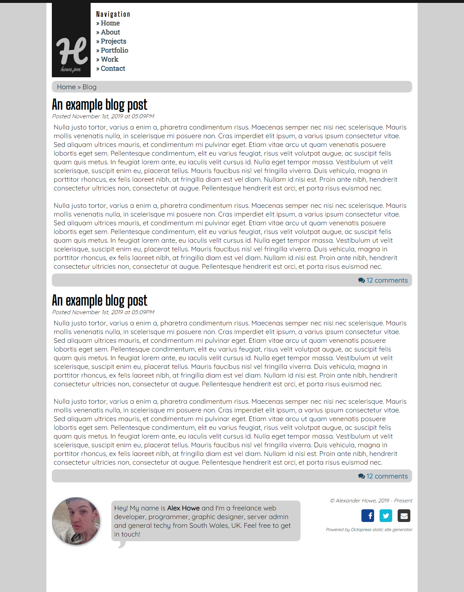

### Overview

This is a version of my website that I was planning to use Jekyll for as a static site to reduce overheads. [You can see an example of this hosted at http://portfolio.howe.pm/mysite/](http://portfolio.howe.pm/mysite/).

As usual, I used SASS and CoffeeScript as preprocessors.

It is a work in progress but I think it would look nice for a personal blog site with a portfolio, projects section and maybe a few others tacked on. Eventually, this will be live on http://howe.pm/

A screenshot is available, although I think visiting the live site may be a little better.

# Screenshot

